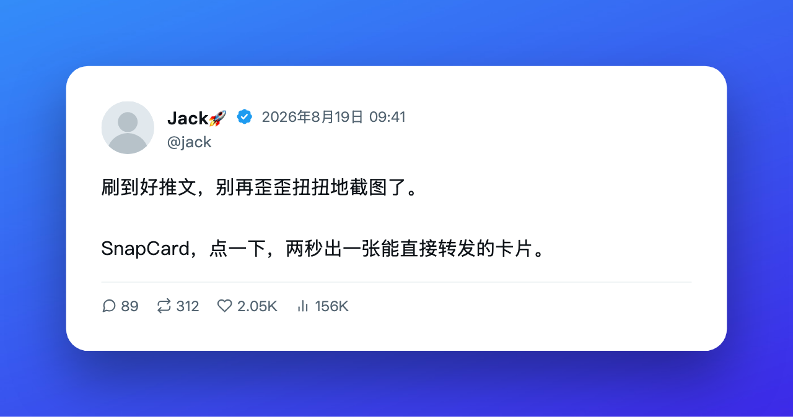

# SnapCard（中文）

由 [X榜单](https://xbangdan.com) 出品 · 追踪 X 中文圈优质账号的公开榜单

一键把 X（推特）上的任意一条推文变成好看的分享卡片。

## 功能

- 在每条推文的互动栏（回复/转发/点赞旁边）加一个小相机图标
- 点一下生成卡片：头像、昵称、@handle、正文、配图、互动数据
- 三种卡片样式：白色、黑色、壁纸（卡片居中放在背景图上，带柔和阴影），选择会被记住
- 壁纸样式内置 7 张原创渐变背景，也支持上传自己的图片。喜欢 macOS 官方壁纸的用户可以自行去苹果官网下载，再用「上传背景」用上（插件本身不内置任何苹果版权素材）
- 可选一键翻译成中文（谷歌翻译），生成原文+译文的双语卡片
- 支持下载 PNG，或直接复制图片到剪贴板
- 可选在卡片右下角显示 SnapCard 署名水印，默认关闭，插件弹窗里可以打开
- 数据全部从页面 DOM 读取，不需要登录、不需要 API Key、不做任何追踪
- 零第三方依赖，无需构建

## 安装

不会用 git 的朋友：去 [Releases](https://github.com/jedeeai/snapcard/releases) 下载最新的 zip 解压，从下面第 2 步开始。

1. 下载或克隆本仓库。
2. 打开 Chrome 的 `chrome://extensions`。
3. 打开右上角「开发者模式」。
4. 点「加载已解压的扩展程序」，选择本项目文件夹。
5. 打开 x.com 或 twitter.com，推文互动栏就会出现相机图标。

## 使用方法

1. 点推文上的相机图标。
2. 弹出预览窗口，能看到生成的卡片。
3. 选一个样式：白色／黑色／壁纸。壁纸样式下点「更多壁纸」展开全部内置背景，也可以上传自己的图片当背景（最多 6 张，可删除）。
4. 如果推文正文以非中文为主，会出现「翻译」开关，打开后正文下方会加一段中文译文。
5. 点「下载 PNG」保存卡片，或点「复制图片」把图片复制到剪贴板。

被折叠（「显示更多」）的推文只能抓到可见部分，弹窗会提示先点开推文全文再生成。

## 隐私

SnapCard 只读取当前页面的 DOM，不收集、不存储、不上传任何数据。

- 卡片生成完全在你的浏览器本地完成。
- 图片直接从 `pbs.twimg.com` / `video.twimg.com` 加载；如果直接加载失败，会走插件自己的后台脚本代理下载（依然只是去拿图片本身，不涉及第三方服务器）。
- 如果你打开了翻译功能，推文正文会发送给谷歌的公开翻译接口（`translate.googleapis.com`）获取译文；只有你主动点「翻译」才会发生这件事，不会发送其他任何内容。
- 没有数据统计、没有账号系统、没有第三方服务器。
- 壁纸样式如果你上传了自定义背景图，会压缩后存在本地（`chrome.storage.local`），只留在你自己电脑上，不会上传到任何地方。

## License

MIT，见 [LICENSE](LICENSE)。

---

# SnapCard

Built by [X榜单 (xbangdan.com)](https://xbangdan.com) · a public leaderboard tracking
quality accounts in the Chinese-language X community.

Turn any post on X (Twitter) into a beautiful, shareable card — right from your timeline.

## Features

- Adds a small camera icon to every tweet's action bar (next to reply/repost/like)
- One click generates a clean card with the avatar, name, handle, text, images and stats
- Three card styles — White (白色), Dark (黑色), and Wallpaper (壁纸: the card centered
  on a background photo with a soft drop shadow) — remembered as your default for next time
- Wallpaper mode ships with 7 built-in original gradient backgrounds, or upload your own photo.
  If you'd rather use one of Apple's official macOS wallpapers, download it yourself from
  Apple's site and add it via "Upload background" — the extension itself ships no
  Apple-copyrighted assets
- Optional one-click translation into Chinese (via Google Translate) for a bilingual card
- Download as PNG, or copy the rendered image straight to your clipboard
- Optional "SnapCard" watermark in the corner of the card — off by default, can be
  turned on from the extension popup
- Everything is read directly from the page DOM — no login, no API keys, no tracking
- Zero third-party dependencies, no build step
- The modal and popup UI are in Simplified Chinese (this extension's primary audience)

## Install

1. Download or clone this repository.
2. Open `chrome://extensions` in Chrome.
3. Turn on "Developer mode" (top right).
4. Click "Load unpacked" and select this project's folder.
5. Open x.com or twitter.com — a camera icon will appear on tweets' action bars.

## Usage

1. Click the camera icon on any tweet.
2. A preview modal opens with the generated card.
3. Pick a style — White, Dark, or Wallpaper. In Wallpaper mode you can upload
   your own background image, or reset back to the built-in one.
4. If the tweet is mostly non-Chinese, a translate toggle appears — turning it
   on adds a Chinese translation below the original text.
5. Download the card as a PNG, or copy the rendered image to your clipboard.

Tweets that are truncated ("Show more") are only partially captured — the
modal will tell you to open the full tweet first.

## Privacy

SnapCard only reads the DOM of the page you're already looking at. It does
not collect, store, or transmit any of your data.

- Card generation happens entirely locally in your browser.
- Images are loaded directly from `pbs.twimg.com` / `video.twimg.com`, or, if
  that fails, proxied through the extension's own background worker (still
  never leaving your machine except to fetch the image itself).
- If you turn on translation, the tweet text is sent to Google's public
  translation endpoint (`translate.googleapis.com`) to get a translation.
  Nothing else is sent, and this only happens when you explicitly turn on
  translation.
- No analytics, no accounts, no third-party servers.
- A custom Wallpaper-mode background you upload is resized and stored locally
  (`chrome.storage.local`) on your own machine — it is never uploaded anywhere.

## License

MIT — see [LICENSE](LICENSE).
